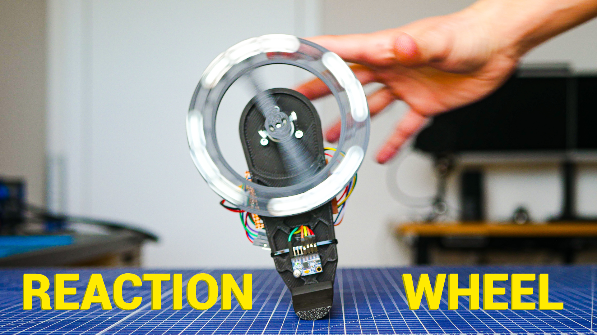

# Reaction Wheel by Nikodem Bartnik

At some point in the past, I made a mistake. I embarked on a reaction wheel project, thinking it would be straightforward after watching a few YouTube videos. It turned out to be far from simple. It took me around 4 or 5 attempts to finally complete the project, during which I made numerous mistakes and learned valuable lessons.

Having previously built my own Arduino-based drone, I've come to realize that stability isn't my forte. However, that hasn't dampened my enthusiasm for future projects.

## Overview
The project was initiated in 2019 but was frequently interrupted by other endeavors. There were times when I felt frustrated after days of working on it without making any progress. With this candid introduction, I must caution you that this project isn't the easiest for beginners.

## Parts
Most parts are simply 3D printed. You will also need:
* [Arduino Nano](https://amzn.to/49duqW5)- A small and inexpensive option that can be easily soldered to a protoboard. Opting for a smaller size facilitates stabilizing smaller masses on the reaction wheel.
* [Nidec24H brushless motor](https://s.click.aliexpress.com/e/_DFDXhbX) - This motor is popular for building reaction wheels due to its high torque and integrated driver.
* [MPU6050](https://amzn.to/3Tzr75X) - An affordable and widely used accelerometer and gyroscope. While its data may not be pristine, it gets the job done. Consider upgrading to a higher-quality alternative if necessary, albeit at a higher cost.
* [Protoboard](https://amzn.to/4cDcS8C) - Any size will suffice, and you can always trim it down to fit. It's handy for creating a compact board with all the necessary components attached to the back of your reaction wheel.
* [Bluetooth module](https://amzn.to/3IZgXGY) -  Essential for fine-tuning the PID algorithm.
* Other components: Screws, nuts, LiPo battery, cables.

## Video about the project
